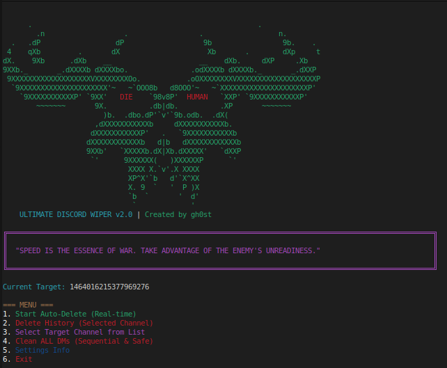

# 🛡️ Ultimate Discord Wiper (Self-Bot)

**Ultimate Discord Wiper** is an advanced, automated tool designed to manage and delete your Discord Direct Messages (DMs) efficiently and securely. Unlike basic deletion scripts, this tool focuses on **privacy protection**, **safety against bans**, and **ease of use** via an interactive CLI.

> [!WARNING]
> **Use at your own risk.** Automating user accounts (Self-botting) is technically against Discord Terms of Service. This tool includes safety delays to mimic human behavior, but safety is never 100% guaranteed.

---

## 🚀 Key Features / Główne Funkcje

### 🛠️ Functionality / Funkcjonalność
*   **📅 Delete by Date / Usuwanie po Dacie**: Remove messages older than a specific day (e.g., wipe everything before 2024).
*   **🔍 Phrase Filter / Filtr Fraz**: Delete only messages containing a specific word or sentence.
*   **🔢 Amount Limit / Limit Ilości**: Delete only the last N messages (or leave empty for a full wipe).
*   **📂 Multi-Channel / Wybór Rozmów**: Interactive menu to select any DM from your recent history (Top 50).
*   **☢️ Safe Global Wipe / Masowe Czyszczenie**: "Clean ALL DMs" mode that safely clears every open conversation one by one.

### 🛡️ Security / Bezpieczeństwo
*   **🔒 Secure Delete (Anti-Logger)**: Edits messages to random gibberish before deleting to bypass message logging plugins.
*   **💾 Local Backup**: Saves your messages to `backups/deleted_msgs.log` before they vanish.
*   **🕒 Smart Delays**: Mimics human behavior with random pauses and a 30s cool-down between different conversations.
*   **📅 Automatic Retention**: Keep your history fresh by auto-deleting messages older than X days in the background.

---

## 🛠️ Installation / Instalacja

### 💻 Windows
1.  **Download Python**: Install Python 3.8+ from [python.org](https://www.python.org/) (Check "Add Python to PATH").
2.  **Download Bot**: `git clone https://github.com/GH0ST-codes-pl/-Ultimate-Discord-Wiper-Self-Bot-.git`
3.  **Install Requirements**: `pip install -r requirements.txt`
4.  **Run**: `python bot.py`

### 🐧 Linux / macOS
1.  **Install Python**: `sudo apt install python3 python3-pip git`
2.  **Clone Repo**: `git clone https://github.com/GH0ST-codes-pl/-Ultimate-Discord-Wiper-Self-Bot-.git`
3.  **Install Requirements**: `pip3 install -r requirements.txt`
4.  **Run**: `python3 bot.py`

### 📱 Android (Termux)
1.  **Install Termux** (from F-Droid).
2.  **Update**: `pkg update && pkg upgrade -y`
3.  **Install Build Tools**: `pkg install python git clang make -y`
4.  **Clone & Install**: `git clone ...` then `pip install -r requirements.txt`
5.  **Run**: `python bot.py`

---

## 📖 How to Use / Jak Używać

### ⚙️ Step 1: Configuration / Konfiguracja
Edit **`config.txt`**:
*   `USER_TOKEN`: Your Discord authorization token.
*   `SECURE_DELETE`: `true` to edit messages before deleting.
*   `BACKUP_ENABLED`: `true` to save logs locally.
*   `RETENTION_DAYS`: Set to e.g., `30` to auto-clean old messages in the background.

### ⌨️ Step 2: Interactive Menu / Menu Interaktywne
Run `python3 bot.py` and choose:

1.  **Start Auto-Delete**: Real-time cleaning of the current target channel.
2.  **Delete History (Selected Channel)**: 
    *   First, it asks for a **Limit** (how many).
    *   Second, it asks for a **Date** (from when).
    *   Third, it asks for a **Phrase** (filter content).
3.  **Select Target**: Pick someone from your DM list to become the current target.
4.  **Clean ALL DMs**: Safely wipe every single DM conversation you have open. Automatic 30s break between users.

---

## ⚠️ Disclaimer

This tool is for educational purposes only. Validating security vulnerabilities in Discord's API or automating user actions may result in account termination. The developer is not responsible for any bans or damages caused by the use of this tool.

